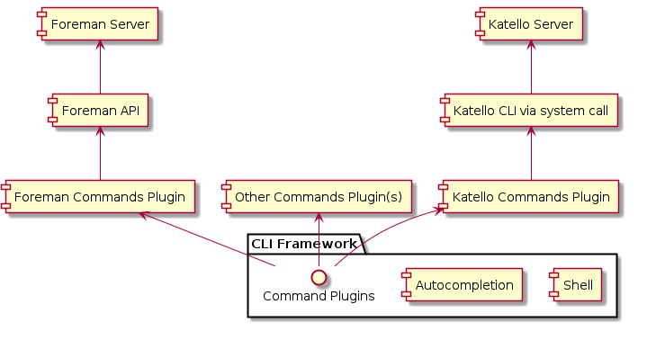

Foreman CLI design draft
========================

This is my attempt to create outline of CLI client for the Foreman. The Foreman project has Ruby as its main langauage, so I choosed to explore the options Ruby world is offering to complete this task.

My initial requirements are as follows:

 - [x] implemented in Ruby
 - [x] Git-like subcomands in CLI app
 - [x] system shell autocompletion of commands and options
 - [x] shell-like environment with autocompletion and history where the commands can be run directly
 - [x] commands extensible via plugins
 - [x] some way to wrap current Katello CLI commands and make it possible to have one CLI client for both
 - [x] simillar UX as from katello CLI

 All the requirements were addressed by the design. Though there is plenty of room for clean up and optimisation, the draft can serve as a proof of concept.

Design
------

As the diagram shows, the CLI consist of almost generic framework (shell-like environment, autocompletion, command help text, option evaluation and command invocation) and set of plugins defining the actual commands. This setup is flexible and allows us to easily install different sets of commands for different products. The plugins are independant and can implement any action as an command, so that besides commands calling Foreman API you can have commands calling varius admin tasks on the server, etc.

For real implementation of the plugins there would need to be some decision taken on how to approach the development of the actual commands.

For *Katello* commands, there can be great deal of work done automatically (using Katello CLI autocompletion feature and templates). However calling Katello CLI via system call is not ideal solution and should be replaced by direct calls to Katello API in the future.

For *Foreman* Commands development I can see three options
 - generate and sync some generic CLI commands (apipie approach) with option to inherit and redefine individual commands
 - manually create everything (Katello CLI approach)
 - dynamic creation on the fly with option to exclude and manually define specific commands

Technologies
------------

### CLI Framework

There is plenty of CLI framework gems with varying features and quality on the Internet. I took into consideration Thor for its wide spread, Boson for its features being very close to our requirements and Clamp for its simplicity.

#### Thor
has well docummented features and good suport in the community. However the codebase was for me quite cryptic and really dificult to understand and extend. It seems good when you need what is built in. If you need something extra adding is time consuming or requires skills beyond mine.

#### Boson
has good documentation, nice set of plugins available, live upstream and what makes it special for us is built in shell with autocompletion.
What put it out of the game is lack of subcommands.

#### Clamp
besides similar features as Thor has it has minimalistic, clean and straghtforward codebase. It uses one class per command which can come handy if you need similar behavior for subset of commands. It was quite easy to add autocompletion and shell. And yes it is the winner for my CLI draft.

### Shell
For shell there is not so much options. There is IRB and similar like Ripl but I started with minimalistic and Readline. It went quite smooth so I  kept it and didn't tried the others

### Autocompletion
I wanted to have one solution for Bash and shell autocompletion and started with simple method recursively looking for endings in command tree. Simple bash wrapper call made it ready for use in bash. In shell-like env based on Readline I had dificulties with the fact that readline support autocompletion based on last word and there is no apparent way to take the context into account. I found some workaround but still looking for cleaner solution. Maybe Ripl + Bond are worth trying

Usage
-----
